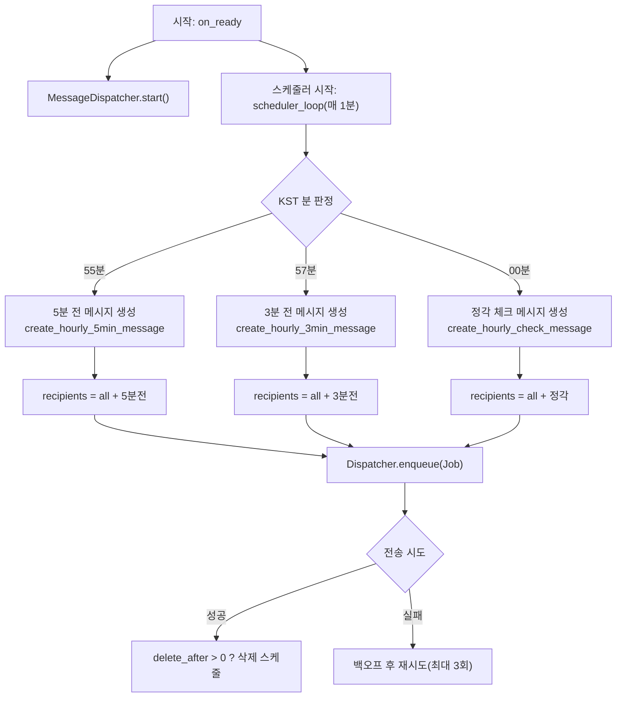
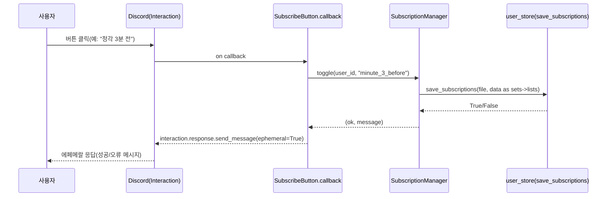
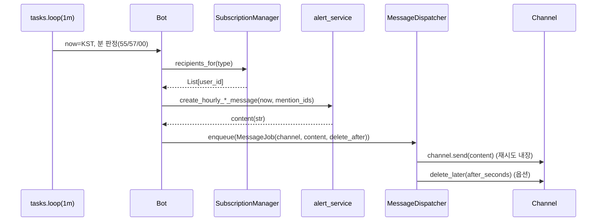
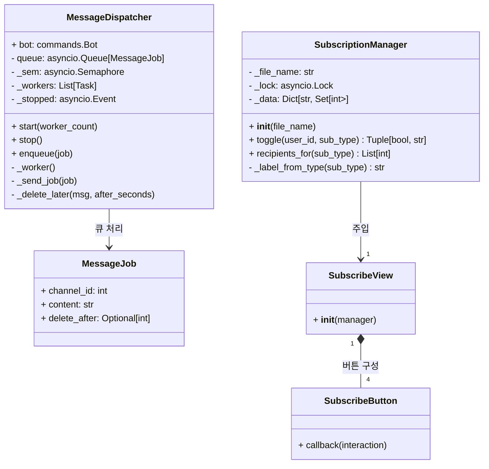

# 마비노기 모바일 결계 알림 디스코드 봇 — **상세 설계서 (Design Spec)**

본 문서는 업로드하신 **최종 소스 전체**를 기준으로 작성한 **프로덕션 등급** 상세 설계서입니다.
(요구사항: 한국어, 표 기반 절차/리스트, 클린코드·SOLID·타입힌트·모듈화·예외처리·성능 최적화 반영)

---

## 1. 문서 개요

| 항목 | 내용                                                        |
| -- | --------------------------------------------------------- |
| 목적 | 결계 알림 봇의 **아키텍처/모듈/데이터/동시성/운영/테스트**를 일관된 표준으로 문서화         |
| 범위 | `main.py` 및 `module/*`, `config/*` 전체 / Docker·Compose 배포 |
| 대상 | 개발자(백엔드/봇), 운영자(DevOps), 검수자(QA), 일반 독자(용어 표 제공)          |

---

## 2. 시스템 개요

| 구분  | 내용                                                       |
| --- | -------------------------------------------------------- |
| 기능  | 매 시 **정각/3분 전/5분 전** 알림 전송, **버튼 기반 구독 토글(에페메랄 응답)**     |
| 안정성 | **큐 기반 디스패처**(세마포어 동시성 제한, 지수 백오프 최대 3회, 자동 삭제 타이머)      |
| 스케줄 | **KST(Asia/Seoul)** 기준 55/57/00 분 트리거, **중복 발사 방지 키** 관리 |
| 저장  | `config/subscribed_users.json`으로 구독 정보 영속화(동시성 락)        |
| 설정  | `config/Config.json` 기반 로딩(**ConfigLoader** 예외 안전)       |
| 로깅  | `module/logger.py` 의 `setup_logger()` 사용(레벨/포맷 표준화)      |

---

## 3. 디렉터리/모듈 구성

| 경로                             | 역할                                                     |
| ------------------------------ | ------------------------------------------------------ |
| `main.py`                      | 엔트리포인트(봇 생성/설정 로딩/명령 등록 호출)                            |
| `module/config_loader.py`      | `Config.json` 안전 로딩 유틸(형식/존재 예외 처리)                    |
| `module/bot_factory.py`        | 봇/커맨드/스케줄러/디스패처/구독뷰 등록의 핵심 팩토리                         |
| `module/user_store.py`         | 구독자 집합 파일 입출력(JSON↔set 변환), 경로는 `get_app_dir()/config` |
| `module/alert_service.py`      | 알림 메시지 문자열 템플릿(정각/3분/5분)                               |
| `module/utils.py`              | 실행 경로 기준 앱 디렉터리 계산(`get_app_dir`)                      |
| `module/logger.py`             | 로깅 초기화(`setup_logger()` 제공)                            |
| `module/__init__.py`           | 패키지 퍼사드(facade), 공개 심볼 재노출, `__version__`(사이드이펙트 없음)   |
| `config/Config.json`           | 실행 설정(채널/토큰 등)                                         |
| `config/subscribed_users.json` | 구독자 정보(봇이 자동 관리)                                       |

---

## 4. 요구사항

### 4.1 기능 요구사항

| ID    | 요구사항    | 상세                                                                                     |
| ----- | ------- | -------------------------------------------------------------------------------------- |
| FR-01 | 구독 토글   | `전체 / 정각 / 3분 전 / 5분 전` 버튼으로 구독/해제(에페메랄 응답)                                            |
| FR-02 | 스케줄 알림  | 55/57/00 분 트리거, **중복 발사 방지**                                                           |
| FR-03 | 대상자 계산  | 전송대상 = `all ∪ 개별(sub_type)`                                                            |
| FR-04 | 메시지 템플릿 | `alert_service`에서 멘션 포함 문자열 생성                                                         |
| FR-05 | 자동 삭제   | `MESSAGE_RETENTION_SECONDS`(0이면 미삭제)                                                   |
| FR-06 | 운영 명령   | `#set_channel`, `#set_debug_channel`, `#set_retention_seconds`, `#알림구독`, `#test_alert` |

### 4.2 비기능 요구사항

| ID     | 요구사항     | 상세                               |
| ------ | -------- | -------------------------------- |
| NFR-01 | 동시성 안전   | 구독 저장 락(`asyncio.Lock`), 전송 세마포어 |
| NFR-02 | 복원력      | 지수 백오프 재시도(최대 3회)                |
| NFR-03 | 가독성/유지보수 | 타입힌트/주석/모듈 단일 책임(SOLID)          |
| NFR-04 | 배포 표준화   | Docker/Compose, 설정 볼륨 마운트        |
| NFR-05 | 보안       | 토큰 미커밋, 시크릿 주입/외부 파일             |

---

## 5. 아키텍처 개요(Flow)



> 호환 팁: 렌더러 이슈 시 각 라인 끝 **`;` 유지**, 라벨 줄바꿈은 **`<br/>`** 사용, `∪` → `+` 대체.

---

## 6. 데이터 모델

### 6.1 `Config.json` 스키마(최소 예시)

```json
{
  "TOKEN": "YOUR_DISCORD_BOT_TOKEN",
  "DEFAULT_CHANNEL_ID": 123456789012345678,
  "DEBUG_CHANNEL_ID": 123456789012345678,
  "TEST_ROLE_NAME": "봇 매니저",
  "MESSAGE_RETENTION_SECONDS": 600
}
```

| 키                           | 타입            | 설명                   |
| --------------------------- | ------------- | -------------------- |
| TOKEN                       | string        | 디스코드 봇 토큰(저장소 커밋 금지) |
| DEFAULT\_CHANNEL\_ID        | int           | 알림 전송 기본 채널          |
| DEBUG\_CHANNEL\_ID          | int           | 디버그 채널(선택)           |
| TEST\_ROLE\_NAME            | string        | 운영 명령 사용 가능한 역할      |
| MESSAGE\_RETENTION\_SECONDS | int(0\~21600) | 자동 삭제 초(0=미삭제)       |

### 6.2 `subscribed_users.json` 구조

```json
{
  "minute_5_before": [862268878805139456],
  "minute_3_before": [],
  "on_time": [],
  "all": [292505059806412801, 1140602583266885762]
}
```

| 항목                | 타입         | 설명                    |
| ----------------- | ---------- | --------------------- |
| minute\_5\_before | List\[int] | 5분 전 알림 수신자           |
| minute\_3\_before | List\[int] | 3분 전 알림 수신자           |
| on\_time          | List\[int] | 정각 알림 수신자             |
| all               | List\[int] | 전체 알림 수신자(개별과 합집합 계산) |

---

## 7. 핵심 컴포넌트 설계

### 7.1 SubscriptionManager

| 항목 | 내용                                                                     |
| -- | ---------------------------------------------------------------------- |
| 책임 | 구독 상태 관리(메모리), 파일 I/O(동시성 락), `all` ↔ 개별의 배타/합집합 규칙 보장                 |
| 내부 | `_data: Dict[str, Set[int]]`, `_lock: asyncio.Lock`, `_file_name: str` |
| 규칙 | `all` 토글 시 개별 해제 / 개별 토글 시 `all`에서 제외                                  |

```python
class SubscriptionManager:
    def __init__(self, file_name: str) -> None: ...
    async def toggle(self, user_id: int, sub_type: str) -> tuple[bool, str]: ...
    def recipients_for(self, sub_type: str) -> list[int]: ...
```

### 7.2 MessageDispatcher (+ MessageJob)

| 항목 | 내용                                                                            |
| -- | ----------------------------------------------------------------------------- |
| 책임 | 큐 기반 전송, 동시성 제한, 지수 백오프(최대 3회), 자동 삭제                                         |
| 내부 | `queue: asyncio.Queue[MessageJob]`, `_sem: Semaphore`, `_workers: list[Task]` |

```python
@dataclass
class MessageJob:
    channel_id: int
    content: str
    delete_after: Optional[int] = None

class MessageDispatcher:
    def __init__(self, bot: commands.Bot, concurrency: int = 2) -> None: ...
    def start(self, worker_count: int = 2) -> None: ...
    async def enqueue(self, job: MessageJob) -> None: ...
```

### 7.3 스케줄러 (`tasks.loop`)

| 항목 | 내용                                                    |
| -- | ----------------------------------------------------- |
| 주기 | `@tasks.loop(minutes=1, reconnect=True)`              |
| 판정 | `KST` 기준 분(`55/57/00`) + **중복 방지 키(last\_fired\_at)** |
| 처리 | 대상자 계산 → 템플릿 생성 → 디스패처 enqueue                        |

---

## 8. 상호작용 시퀀스

### 8.1 구독 버튼 클릭



### 8.2 스케줄 → 전송



---

## 9. 봇 명령(운영)

| 명령                             | 설명                               |
| ------------------------------ | -------------------------------- |
| `#test_alert`                  | 권한 검증(미보유 시 1초 후 삭제 시도 포함 예외 처리) |
| `#set_channel <id>`            | 알림 채널 ID 변경(유효성 검사)              |
| `#set_debug_channel <id>`      | 디버그 채널 ID 변경                     |
| `#set_retention_seconds <sec>` | 자동 삭제 시간(0\~21600초) 변경           |
| `#알림구독`                        | 구독 안내 임베드 + 버튼 전송(관리 권한 필요)      |

---

## 10. 오류/예외 처리 정책

| 상황          | 처리                                 | 사용자/로그 메시지               |
| ----------- | ---------------------------------- | ------------------------ |
| 설정 파일 누락/오류 | `ConfigLoader`에서 예외 처리·로깅          | 콘솔/로그에 원인 표시(운영 전 검증 권장) |
| 채널 ID 무효    | `get_channel(...) is None`         | 사용자에게 “채널을 찾을 수 없습니다”    |
| 권한 부족       | 역할 검증 실패 / `discord.Forbidden`     | 사용자에게 권한 부족 메시지          |
| HTTP 예외     | `discord.HTTPException`            | 디버그 로그·디스패처 재시도          |
| 전송 실패       | 지수 백오프 후 포기                        | 디버그 채널 로그 권장             |
| 파일 저장 실패    | `save_subscriptions(...) -> False` | 에페메랄로 실패 안내              |

---

## 11. 동시성/성능 최적화

| 항목     | 전략                                                |
| ------ | ------------------------------------------------- |
| 파일 I/O | `asyncio.Lock`으로 경쟁 조건 방지                         |
| 전송 동시성 | 디스패처 `Semaphore`로 제한(기본 2). 서버 레이트리밋 상황에 맞춰 조절 가능 |
| 재시도    | 지수 백오프(1s→2s→4s), 최대 3회                           |
| 중복 방지  | `last_fired_at` 키로 동일 분 중복 발사 차단                  |
| 메모리 사용 | 구독 데이터 메모리 캐시 후 저장 시 직렬화(set↔list)                |

---

## 12. 로깅/모니터링

| 항목  | 내용                                        |
| --- | ----------------------------------------- |
| 초기화 | `module/logger.py`의 `setup_logger()`      |
| 포맷  | `%(asctime)s [%(levelname)s] %(message)s` |
| 레벨  | 기본 `INFO`(필요 시 `DEBUG`)                   |
| 권장  | 실패/재시도/최종 에러 카운트 수집(추후 메트릭 연동 여지)         |

---

## 13. 보안 정책

| 항목    | 권장                                       |
| ----- | ---------------------------------------- |
| 토큰    | 저장소 커밋 금지. **외부 파일/환경변수/시크릿 매니저** 사용     |
| 권한 분리 | 운영/디버그 채널 분리, `TEST_ROLE_NAME`로 운영 명령 제한 |
| 최소 권한 | 봇에 필요한 최소 권한(메시지 전송/삭제)만 부여              |

---

## 14. 환경/버전 요구사항

| 항목     | 권장/확인 사항                                           |
| ------ | -------------------------------------------------- |
| Python | 3.11.x (`python:3.11-slim`)                        |
| OS     | 리눅스/윈도우/맥OS(운영은 Docker 권장)                         |
| 라이브러리  | `requirements.txt` 준수                              |
| 타임존    | 코드 `ZoneInfo("Asia/Seoul")` + 컨테이너 `TZ=Asia/Seoul` |

---

## 15. 배포

### 15.1 Docker (단일 컨테이너)

| 목적     | 명령                                                                                                                             |
| ------ | ------------------------------------------------------------------------------------------------------------------------------ |
| 이미지 빌드 | `docker build -t discord-bot:latest .`                                                                                         |
| 1회 실행  | `docker run -d --name discord-bot --restart=unless-stopped -e TZ=Asia/Seoul -v "$(pwd)/config:/app/config" discord-bot:latest` |
| 로그 확인  | `docker logs -f --tail=200 discord-bot`                                                                                        |
| 재시작    | `docker restart discord-bot`                                                                                                   |
| 중지/삭제  | `docker stop discord-bot && docker rm discord-bot`                                                                             |

### 15.2 Docker Compose

`docker-compose.yml` 예시:

```yaml
version: "3.9"
services:
  discord-bot:
    build: .
    container_name: discord-bot
    restart: unless-stopped
    environment:
      - TZ=Asia/Seoul
    volumes:
      - ./config:/app/config:rw
```

| 단계 | 설명  | 명령                                  |
| -- | --- | ----------------------------------- |
| 1  | 빌드  | `docker compose build --no-cache`   |
| 2  | 실행  | `docker compose up -d`              |
| 3  | 로그  | `docker compose logs -f --tail=200` |
| 4  | 재시작 | `docker compose restart`            |
| 5  | 중지  | `docker compose stop`               |
| 6  | 삭제  | `docker compose down`               |

> `./config/Config.json`은 **로컬 파일로 제공**(시크릿 커밋 금지). `subscribed_users.json`도 같은 디렉터리에 저장되어 **데이터 지속**.

---

## 16. 테스트 계획

| 구분 | 시나리오                         | 기대결과                     |
| -- | ---------------------------- | ------------------------ |
| 단위 | `SubscriptionManager.toggle` | `all`↔개별 배타 규칙 보장, 저장 성공 |
| 단위 | `user_store` set↔list        | JSON 저장/로드 일치            |
| 단위 | `alert_service`              | 멘션/시각 포맷 정상              |
| 통합 | 스케줄(55/57/00)                | 각 1회 발사, 중복 없음           |
| 통합 | 디스패처 재시도                     | 일시 오류 후 성공 시 1\~2회 내 종료  |
| 통합 | 자동 삭제                        | retention>0이면 삭제, 0이면 유지 |
| 운영 | 권한 검증                        | 비권한자 명령 차단, 안내 메시지       |

---

## 17. 운영 런북(장애 대응)

| 증상     | 점검                     | 조치                        |
| ------ | ---------------------- | ------------------------- |
| 알림 미도착 | `docker logs`/채널 권한/ID | `#set_channel` 재지정, 권한 부여 |
| 중복 발사  | `last_fired_at` 키      | 단일 인스턴스 확인, 봇 재시작         |
| 삭제 실패  | 봇 권한/메시지 권한            | 권한 부여 후 재시도               |
| 저장 실패  | `config` 권한/디스크        | 퍼미션/마운트 수정                |
| 레이트리밋  | 로그에 rate-limit 힌트      | 동시성/재시도 간격 조정             |

---

## 18. 코드 품질 원칙(클린코드/SOLID)

| 원칙  | 반영                                  |
| --- | ----------------------------------- |
| SRP | 모듈 단일 책임(로더/스토어/디스패처/뷰/스케줄)         |
| OCP | 기능 확장 시 기존 클래스 수정 최소화(새 구독 타입 추가 등) |
| LSP | 추후 전송 채널/전송자 추상화 시 교체 가능 설계 여지      |
| ISP | 컴포넌트별 필요한 인터페이스만 공개(퍼사드로 단순화)       |
| DIP | 상위(스케줄) → 하위(템플릿/디스패처) 의존 역전 여지     |

---

## 19. 용어/약어 표(일반인용)

| 용어           | 쉬운 설명                                 |
| ------------ | ------------------------------------- |
| 정각/3분 전/5분 전 | 매 시각의 00/57/55분. 그때 알림을 보냅니다.         |
| 구독 토글        | 버튼으로 알림을 **켜거나 끄는** 동작(다시 누르면 반대로 바뀜) |
| 멘션           | 특정 사용자 호출(@아이디)로 푸시 알림 전송             |
| 에페메랄 응답      | **본인에게만 보이는** 일회성 응답(다른 사람은 못 봄)      |
| 큐/디스패처       | 작업을 대기열(큐)에 쌓고, 순서대로 보내는 담당자(디스패처)    |
| 세마포어         | 동시에 처리할 수 있는 **갯수 제한 장치**             |
| 지수 백오프       | 실패하면 **1→2→4초**처럼 대기시간을 늘려가며 재시도      |
| 레이트리밋        | 너무 자주 요청하면 막히는 서버의 안전장치               |
| KST          | 한국 표준시(Asia/Seoul)                    |
| 퍼사드          | 여러 모듈을 **한곳에서 깔끔히 모아** 내보내는 방식        |
| 사이드이펙트       | 임포트만 해도 실행되는 무거운 동작(이 파일들에선 금지)       |

---

## 20. 부록 — 클래스 다이어그램



---

필요하시면 이 문서를 **README.md로 통합**하거나, **PDF/위키 포맷**으로 변환해 드릴게요. 개발/운영 환경에 맞춰 **헬스체크(HTTP 엔드포인트) 추가 설계**와 **pytest 스켈레톤**도 이어서 만들어 드릴 수 있습니다.
