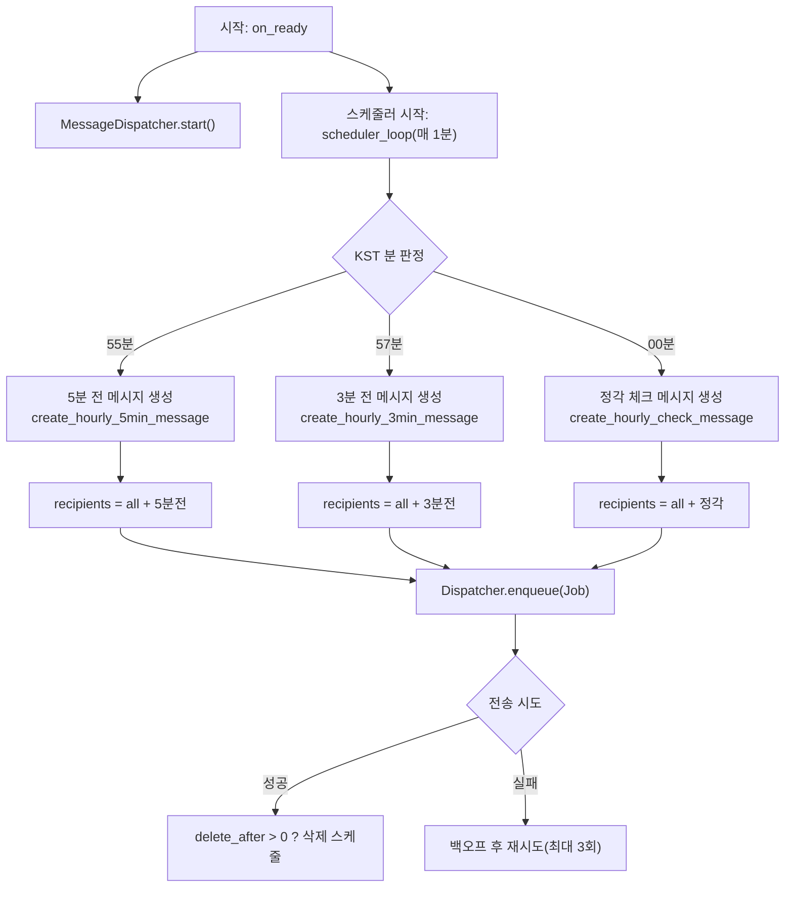
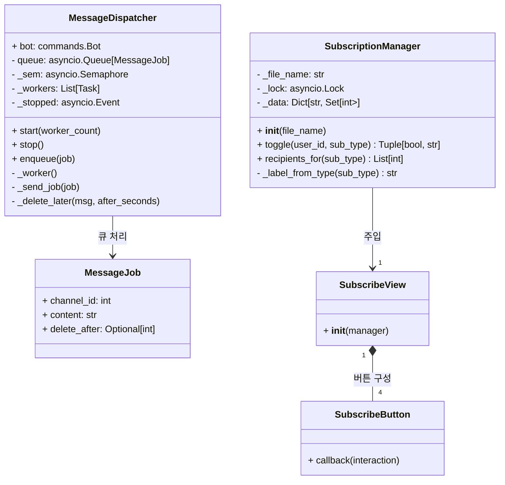
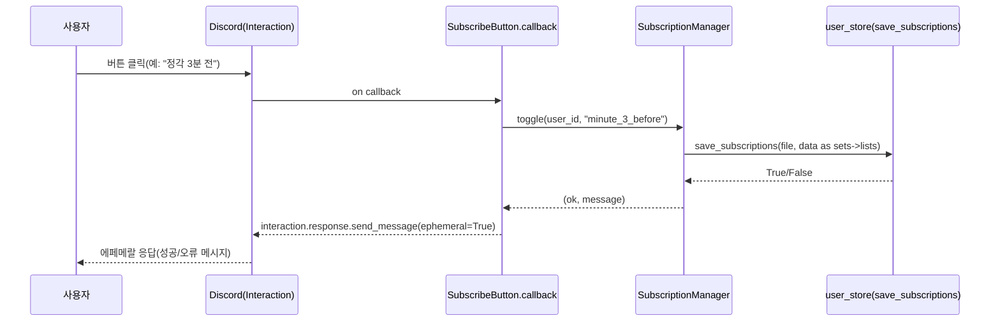
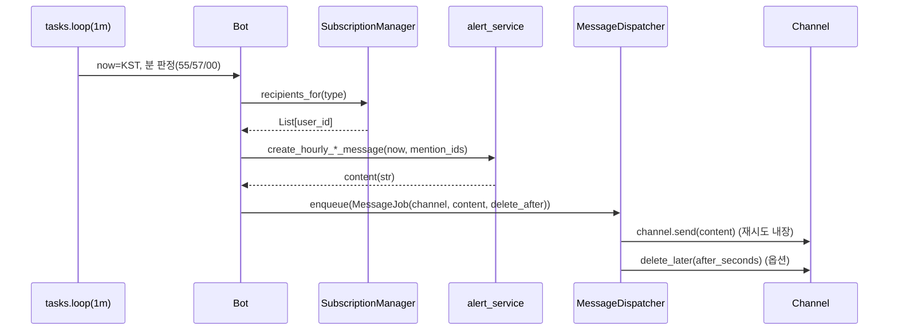

# 마비노기 모바일 결계 알림 디스코드 봇

**정각/3분 전/5분 전**에 맞춰 결계 알림을 전송하고, **버튼으로 구독을 토글**할 수 있는 디스코드 봇입니다.
메시지는 **큐 기반 디스패처**가 안정적으로 전송·재시도·자동삭제까지 관리합니다.

---

## 용어/약어 표

| 용어/약어                           | 쉬운 설명                                                       |
| ------------------------------- | ----------------------------------------------------------- |
| **정각/3분 전/5분 전**                | 매 시각의 00분/57분/55분을 말해요. 그때 알림이 나가요.                         |
| **구독 토글**                       | 버튼을 눌러 알림을 **켜거나 끄는** 동작이에요. 다시 누르면 반대로 바뀝니다.               |
| **멘션(Mention)**                 | 특정 사람을 호출하는 기능(@아이디). 멘션된 사람에게 알림이 와요.                      |
| **에페메랄(Ephemeral) 응답**          | **자기에게만 보이는** 1회성 응답(다른 사람은 못 봅니다).                         |
| **큐(Queue)**                    | 순서대로 처리하려고 **대기열**에 작업을 쌓아두는 구조예요.                          |
| **디스패처(Dispatcher)**            | 대기열의 작업을 하나씩 꺼내 **보내는 담당자**에요. 실패하면 다시 시도해요.                |
| **세마포어(Semaphore)**             | **동시에 처리되는 갯수**를 제한하는 장치(한꺼번에 너무 많이 보내면 실패하므로).             |
| **지수 백오프(Exponential Backoff)** | 실패하면 \*\*1초→2초→4초…\*\*처럼 대기시간을 늘려가며 재시도하는 방식이에요.            |
| **레이트리밋(Rate Limit)**           | 너무 자주 요청하면 막히는 제한. 디스코드 서버가 과부하를 막기 위한 규칙이에요.               |
| **KST**                         | 한국 표준시(Asia/Seoul). 한국 시간 기준으로 스케줄이 동작해요.                   |
| **퍼사드(Facade)**                 | 여러 모듈을 **한 곳에서 깔끔하게 모아 공개**하는 방식(사용하기 쉽게 만드는 포장).           |
| **사이드이펙트(Side Effect)**         | 임포트만 해도 실행되는 무거운 동작(파일 IO/스케줄 시작 등). `__init__.py`에서는 금지해요. |


---

## 기능 한눈에 보기

| 구분       | 내용                                                                              |
| -------- | ------------------------------------------------------------------------------- |
| 구독 시스템   | `전체 / 정각 / 3분 전 / 5분 전` 유형별 구독 토글. `all ∪ 개별` 집합으로 수신자 계산. 동시성 안전(락) 및 파일 영속화.  |
| 스케줄러     | **KST(Asia/Seoul)** 기준 55분(5분 전), 57분(3분 전), 00분(정각) 트리거. 중복 발사 방지 키 관리.        |
| 메시지 디스패처 | 작업 큐 + 세마포어 동시성 제한 + 지수 백오프(최대 3회) + 자동 삭제 스케줄.                                 |
| 인터랙션 UI  | 디스코드 버튼(이모지 포함) 기반 **구독/해제** 에페메랄 응답.                                           |
| 알림 포맷    | 멘션 목록 포함 메시지 템플릿(정각/3분/5분 전).                                                   |
| 설정/경로    | 실행 디렉터리 기준 `config/` 하위에 설정·구독자 파일 저장. `get_app_dir()` 유틸.                      |
| 로깅       | `logging.basicConfig` 포맷/레벨 지정.                                                 |

---

## 환경/버전 요구사항

| 항목            | 권장/확인 사항                                                   |
| ------------- | ---------------------------------------------------------- |
| Python        | 3.11.x (Docker 베이스: `python:3.11-slim`)                    |
| OS            | 리눅스/윈도우/맥OS 모두 가능(운영은 Docker 권장)                           |
| Discord 라이브러리 | `discord.py` 최신 안정판(요구사항은 `requirements.txt` 사용)           |
| 타임존           | 코드 내부 `ZoneInfo("Asia/Seoul")`, 컨테이너 `TZ=Asia/Seoul` 병행 권장 |
| 포트/네트워크       | 외부 포트 오픈 불필요(클라이언트 봇)                                     |
| 권한            | 봇 토큰/채널 접근 권한(메시지 전송/삭제 권한 필요)                             |

---

## 디렉터리 구조

| 경로                             | 역할                                                       |
| ------------------------------ | -------------------------------------------------------- |
| `main.py`                      | 엔트리포인트(봇 생성/설정 로딩/명령 등록 호출)                              |
| `module/config_loader.py`      | `Config.json` 안전 로딩 유틸(형식/존재 예외 처리).                     |
| `module/bot_factory.py`        | 봇/커맨드/스케줄러/디스패처/구독뷰 등록의 핵심 팩토리.                          |
| `module/user_store.py`         | 구독자 집합의 파일 입출력(JSON↔set 변환). 경로는 `get_app_dir()/config`. |
| `module/alert_service.py`      | 알림 메시지 문자열 템플릿(정각/3분/5분).                                |
| `module/utils.py`              | 실행 경로 기준 앱 디렉터리 계산(`get_app_dir`).                       |
| `module/logger.py`             | 로깅 초기화(`setup_logger()` 제공).                             |
| `module/__init__.py`           | 패키지 퍼사드(facade) 및 버전 표기(**사이드이펙트 없음**).                  |
| `config/Config.json`           | 실행 설정(채널 ID 등) - 실행 시 이 경로를 사용하도록 권장                     |
| `config/subscribed_users.json` | 구독자 정보(봇이 자동 관리). 경로/파일명은 코드 상수 사용.                      |

---

## 주요 동작 개요(Flow)



* **55/57/00 분 처리 및 중복발사 방지 키**는 `bot_factory._should_fire()`와 `last_fired_at`으로 관리합니다.
* 디스패처는 **큐/세마포어/재시도/자동삭제**를 내장합니다.

---

## 클래스 다이어그램



* `SubscriptionManager`: **동시성 안전** 토글/저장, `all`과 개별 타입의 **배타성 및 합집합 전송 대상** 규칙.
* `MessageDispatcher`: **재시도(지수 백오프), 자동삭제** 포함.
* `SubscribeView/Button`: **에페메랄 응답**으로 사용자에게 피드백.

---

## 시퀀스 다이어그램(구독 버튼 클릭)



## 시퀸스 다이어그램(스케줄 → 전송)



* 파일 저장은 `set→list` 직렬화로 JSON 기록합니다. 경로는 `get_app_dir()/config`.

---

## 설정

| 항목     | 설명                                                            |
| ------ | ------------------------------------------------------------- |
| 실행 경로  | `get_app_dir()` 반환 경로 기준으로 동작(일반 실행 시 `sys.argv[0]`의 디렉터리).   |
| 구독자 저장 | `get_app_dir()/config/subscribed_users.json` (없으면 빈 구조로 시작).  |
| 로깅     | `INFO` 레벨, `%(asctime)s [%(levelname)s] %(message)s` 포맷.      |

> `Config.json`은 `module.ConfigLoader`로 안전하게 읽습니다(파일 없음/JSON 오류/기타 예외 처리).

---

## 봇 커맨드

| 명령                             | 설명                                    |
| ------------------------------ | ------------------------------------- |
| `#test_alert`                  | 권한 검증(미보유 시 1초 후 메시지 삭제 시도 포함 예외처리).  |
| `#set_channel <id>`            | 알림 채널 ID 변경(유효성 검사 후 적용).             |
| `#set_debug_channel <id>`      | 디버그 채널 ID 변경.                         |
| `#set_retention_seconds <sec>` | 자동 삭제 시간(0\~21600s) 변경.               |
| `#알림구독`                        | 구독 안내 임베드+버튼 전송(관리 권한 확인).            |

---

## 알림 메시지 포맷

| 트리거       | 메시지 생성 함수                       | 비고           |
| --------- | ------------------------------- | ------------ |
| 55분(5분 전) | `create_hourly_5min_message()`  | 멘션 포함 문자열 생성 |
| 57분(3분 전) | `create_hourly_3min_message()`  | 멘션/안내 포함     |
| 00분(정각)   | `create_hourly_check_message()` | 멘션 포함 프롬프트   |

---

## 로컬 실행(개발)

| 단계        | 명령/내용                                                       |
| --------- | ----------------------------------------------------------- |
| 1. 의존성 설치 | `pip install -r requirements.txt`                           |
| 2. 설정 준비  | `config/Config.json` 생성 및 채널/토큰 등 값 지정(또는 환경변수 사용 시 코드에 맞춤) |
| 3. 실행     | `python main.py`                                            |

> `ConfigLoader`는 파일 없거나 JSON 오류 시 예외를 명확히 던지므로, 개발 중에는 경로/형식 확인을 권장합니다.

---

## Docker 배포

### 1) 이미지 빌드 & 실행(권장)

| 목적     | 명령                                                                                                                             |
| ------ | ------------------------------------------------------------------------------------------------------------------------------ |
| 이미지 빌드 | `docker build -t discord-bot:latest .`                                                                                         |
| 1회 실행  | `docker run -d --name discord-bot --restart=unless-stopped -e TZ=Asia/Seoul -v "$(pwd)/config:/app/config" discord-bot:latest` |
| 로그 확인  | `docker logs -f --tail=200 discord-bot`                                                                                        |
| 재시작    | `docker restart discord-bot`                                                                                                   |
| 중지/삭제  | `docker stop discord-bot && docker rm discord-bot`                                                                             |

### 2) 운영 절차 요약

| 단계 | 설명      | 명령(예시)                                                                                                                           |
| -- | ------- | -------------------------------------------------------------------------------------------------------------------------------- |
| 1  | 빌드      | `docker build -t discord-bot:YYYYMMDD .`                                                                                         |
| 2  | 기존 종료   | `docker stop discord-bot && docker rm discord-bot`                                                                               |
| 3  | 실행      | `docker run -d --name discord-bot --restart=unless-stopped -e TZ=Asia/Seoul -v /srv/bot/config:/app/config discord-bot:YYYYMMDD` |
| 4  | 헬스체크    | `docker logs -f discord-bot`                                                                                                     |
| 5  | 롤백(필요시) | `docker run -d --name discord-bot-rollback discord-bot:PREV_TAG`                                                                 |

> 시간대는 코드에서도 `ZoneInfo("Asia/Seoul")`를 사용합니다. 컨테이너 환경변수 `TZ=Asia/Seoul`을 함께 지정하면 로그/시스템 시간 일관성이 높아집니다.

---

## 설정/데이터 볼륨

| 마운트                           | 설명                                                                                         |
| ----------------------------- | ------------------------------------------------------------------------------------------ |
| `-v /path/config:/app/config` | `Config.json` 및 `subscribed_users.json` 지속화(컨테이너 재배포 시에도 데이터 유지). `user_store`가 이 경로를 사용.  |
> ⚠️ 주의: 실제 토큰은 평문으로 저장소에 커밋하지 마세요. 안전한 비밀 관리 방식(예: 배포 시 볼륨 마운트된 파일/시크릿 매니저/환경변수 주입)을 사용하세요.

```json
{
  "TOKEN": "YOUR_DISCORD_BOT_TOKEN",
  "DEFAULT_CHANNEL_ID": 123456789012345678,
  "DEBUG_CHANNEL_ID": 123456789012345678,
  "TEST_ROLE_NAME": "봇 매니저",
  "MESSAGE_RETENTION_SECONDS": 600
}

```

---

## 운영 팁

| 주제           | 권장                                                                      |
| ------------ | ----------------------------------------------------------------------- |
| 메시지 과다/중복 방지 | `last_fired_at` 키로 중복 발사 방지되나, 장애 시 **디버그 채널**로 상황 통보 로직을 활성화하는 것도 고려.  |
| 자동 삭제        | `#set_retention_seconds`로 조정(0\~21600). 대기열/레이트리밋 상황엔 디스패처가 재시도.        |
| 권한           | `test_role_name` 보유자만 설정 명령 사용.                                         |
| 로그           | 기본 INFO. 필요 시 `module/logger.py` 조정.                                    |

---

## 보안

| 항목    | 내용                                                |
| ----- | ------------------------------------------------- |
| 토큰 관리 | **절대 저장소에 평문 커밋 금지**. 런타임 환경변수나 외부 시크릿 스토어 사용 권장. |
| 권한 분리 | 운영/디버그 채널 분리 권장(`set_debug_channel`).             |

---

## 테스트 체크리스트

| 항목         | 기대결과                                        |
| ---------- | ------------------------------------------- |
| `#알림구독` 전송 | 버튼 4종 노출(정각5/정각3/정각/전체). 에페메랄 응답 정상.        |
| 스케줄 타이밍    | 55/57/00에 각각 1회씩만 발사. 중복발사 없음.              |
| 삭제 타이머     | retention\_seconds 설정값에 따라 자동 삭제.           |
| 파일 영속화     | `config/subscribed_users.json`에 구독자 저장/복원.  |

---

## 부록: 시퀀스 다이어그램(스케줄 → 전송)


